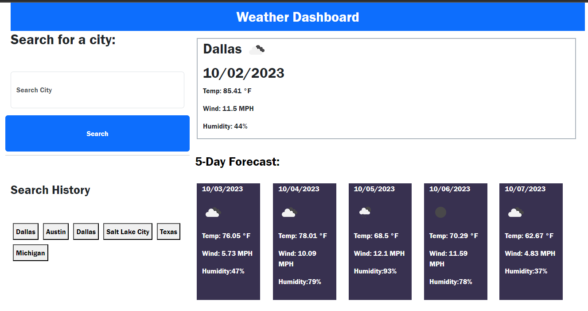

### 5dayForecast
The Weather Dashboard is a web application that allows users to search for the current weather and a 5-day forecast for a specific city. It uses the OpenWeatherMap API to retrieve weather data and displays it in an organized and user-friendly manner.

## Features
# City Search: 
Users can enter the name of a city in the search input field and click the "Search" button to retrieve weather information.

# Search History: 
The application keeps track of previously searched cities, and users can easily access their search history.

# Current Weather Display: 
The current weather for the searched city is displayed, including the city name, date, temperature, wind speed, humidity, and an icon representing the weather condition.

# 5-Day Forecast: 
A 5-day weather forecast is provided, showing the date, weather icon, temperature, wind speed, and humidity for each day.

## JavaScript Explanation
The JavaScript code in this application is responsible for the following functionality:

* Weather Data Retrieval: The performSearch() function handles user input, retrieves weather data from the OpenWeatherMap API, and updates the DOM to display the current weather and forecast.

* Search History: The renderHistory() function manages the search history by creating buttons for previously searched cities. Clicking on these buttons triggers new searches.

* Forecast Rendering: The renderForecast() function takes the retrieved forecast data and updates the DOM to display the 5-day weather forecast.

* Event Listeners: Event listeners are used to trigger the performSearch() function when the "Search" button is clicked and to handle the selection of search history buttons.

# Screenshot
